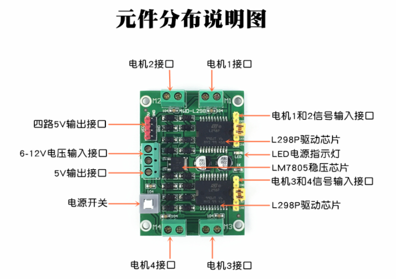
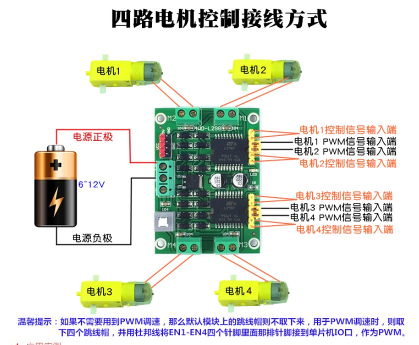
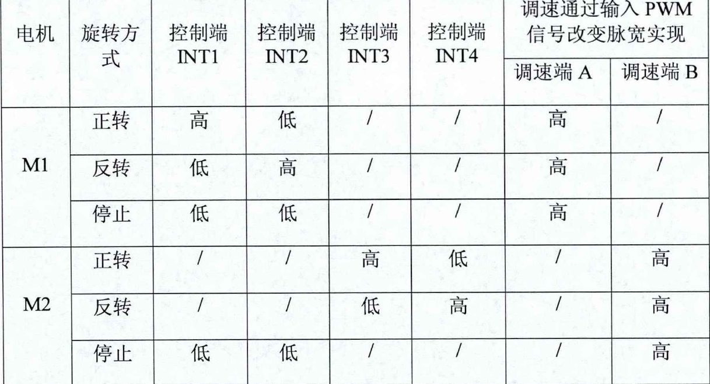

### 实现 rt-robot 框架下开环控制

#### 1. 连接 MCU 与 MOTOR 

- 电机
	电机元件分布说明
	

	电机接线方式
	

	电机控制方式
	

	如上图说明，电机控制需要配置两个 GPIO 和一个 PWM 信号， 用 `PE8 ~ PE15` 作为旋转方式控制脚。

- 遥控器

遥控器使用PS2控制，PS2控制器需要使用SPI接口，故重新修改cube文件后，在 BSP 中增加 SPI1

> SPI 配置补充： CPOL = 1; CPHA = 0

**使用STM32 SPI1 通信一直存在问题，无法读到数据，故采用rt-robot框架自带的PS2控制器代码进行验证，几轮验证后发现是DO和DI接反了导致！！**

调试PS2模块发现数据有乱码情况发生，从说明书上看DI要上拉电阻，修改后搞定！

**右后轮倒转失败**