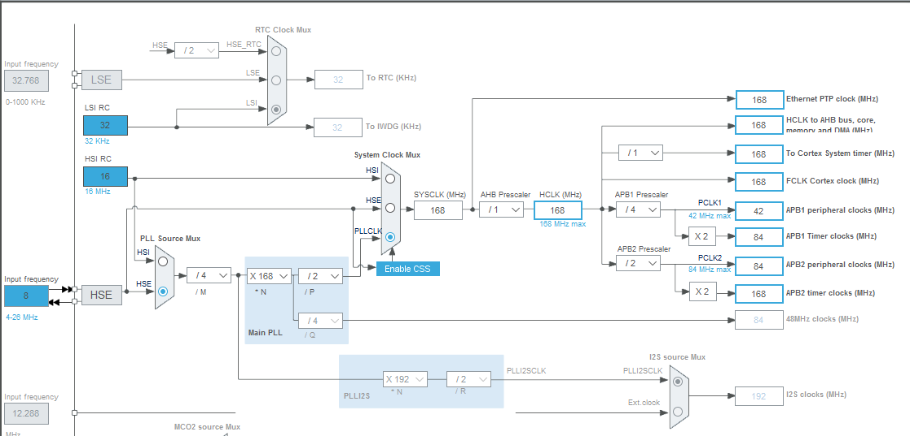

## 硬件环境搭建

#### 一号控制板 [STM32F103RCT6 开发学习板](https://detail.tmall.com/item.htm?id=521780024999&spm=a1z09.2.0.0.594b2e8dVmvi7C&_u=bkvn7e33508)

#### 二号控制板 [STM32F4VET6 开发学习板](https://detail.tmall.com/item.htm?id=521631408046&spm=a1z0k.7386009.0.0.19f637dedRUaKq)

鉴于本项目用到的外设并不多，手上在淘宝入的板卡正好满足要求，就不破费再入 IOT 物联网板卡了。

#### MCU参数

- 一号 MCU : STM32F103RCT6，主频 72MHz , 48KB RAM , 256KB ROM
- 二号 MCU : STM32F407VET6, 主频 168MHz ，512KB FLASH ，192KB RAM

#### 配件列表

- 底盘 [4WD智能小车底盘](https://item.taobao.com/item.htm?spm=a1z0d.6639537.1997196601.220.61187484ephkBL&id=35831296664)

- 电机 [L298P直流电机驱动](https://item.taobao.com/item.htm?spm=a1z0d.6639537.1997196601.255.61187484ephkBL&id=578999575475)

- 遥控器 [2.4G无线遥控手柄](https://item.taobao.com/item.htm?spm=a1z0d.6639537.1997196601.202.61187484ephkBL&id=536581090144)

**上述器件均采用 github 上推荐型号**

## 软件环境搭建 

### STM32F1 软件环境搭建

- BSP 选择
	
	软件环境搭建完全参照rt-thread官网教程，具体步骤如下:

	1. scons 环境搭建。
	2. 下载 rt-thread 程序包 `本项目采用3.1.3`
	3. BSP 文件下下选择 `stm32f10x` ,在该目录下进行menuconfig配置
	4. scons --target=mdk4 生成 keil4 工程
	5. 烧录至开发板，可以正常运行。

- PWM 模块验证

	调试 PWM 驱动时，我突然发现 `stm32f10x` 目录下没有 pwm 的设备层驱动，然后我又不想自己去做这个驱动开发的工作。经微信群友推荐，我查阅了`stm32`目录下的各种bsp。不过经过对比我发现里面工程都不够通用，因此最终选择`stm32f10x_hal`目录下的工程作为本次实验的应用工程。

#### NOTE

STM32F1 应用 PID 性能不够，且 `rt-thread\rt-thread-3.1.3\bsp\stm32f10x-HAL` 目录下 BSP 不再维护.

### STM32F4 软件环境搭建

- BSP 选择

	参照 `rt-thread\rt-thread-3.1.3\bsp\stm32\docs` 下教程制作 BSP , 过程如下：

1.	打开 stm32cubeMX 工程，按照下图修改时钟配置

2.	新创建的 BSP 烧录程序后不能无法正常启动，单步调试发现报错在 heap 调度部分死机 ，通过对照 stm32f407-st-discovery 里的定义，看到虽然 RAM 有192K，设定却只是用了 128KSRAM , 参考设定后编译通过。

- PWM 模块验证

	用官网 PWM 模块验证,可清楚看到 LED 灯渐变。